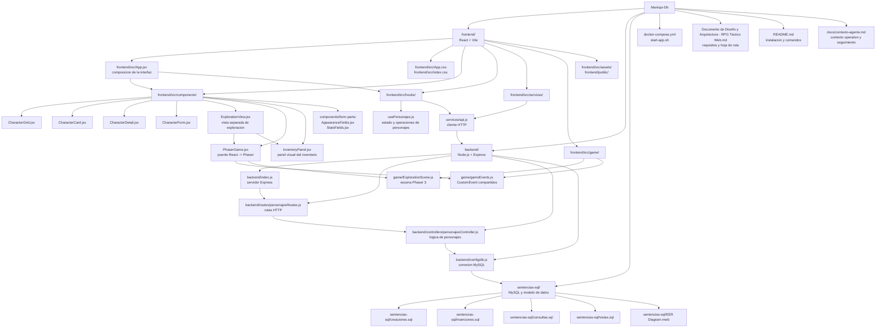
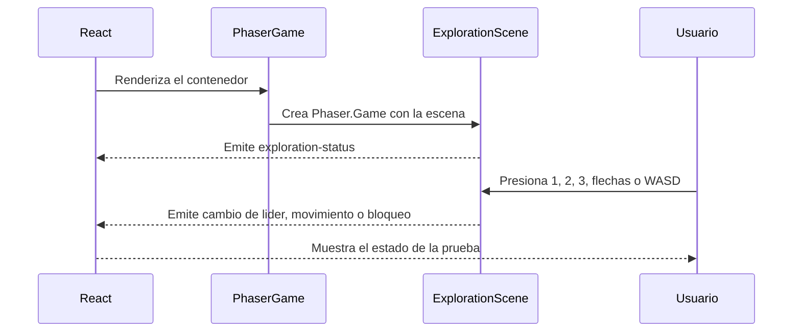

# Grafo del Proyecto

Este documento es el mapa de rutas y responsabilidades del proyecto. Consultalo antes de buscar la ubicacion de un archivo, componente, servicio o modulo. Cuando se agregue, mueva o elimine una pieza estructural, actualiza este grafo en el mismo cambio.



## Rutas clave

| Necesidad | Ruta principal | Depende de |
| --- | --- | --- |
| Entrada de la interfaz | `frontend/src/App.jsx` | componentes, hook de personajes y Phaser |
| Vista separada de exploracion | `frontend/src/components/ExplorationView.jsx` | `PhaserGame.jsx` |
| Montar Phaser en React | `frontend/src/components/PhaserGame.jsx` | `frontend/src/game/ExplorationScene.js` |
| Mostrar inventario | `frontend/src/components/InventoryPanel.jsx` | `ExplorationView.jsx`, `gameEvents.js` |
| Logica del mapa y exploracion | `frontend/src/game/ExplorationScene.js` | Phaser 3 |
| Eventos compartidos React-Phaser | `frontend/src/game/gameEvents.js` | `CustomEvent`, `PhaserGame.jsx`, `ExplorationScene.js` |
| Estado y CRUD de personajes | `frontend/src/hooks/usePersonajes.js` | `frontend/src/services/api.js` |
| Peticiones al backend | `frontend/src/services/api.js` | API Express |
| Entrada de la API | `backend/index.js` | rutas y conexion MySQL |
| Rutas de personajes | `backend/routes/personajesRoutes.js` | controlador de personajes |
| Logica de personajes | `backend/controllers/personajesController.js` | conexion MySQL |
| Conexion a la base de datos | `backend/config/db.js` | MySQL/Docker |
| Esquema y datos SQL | `sentencias-sql/` | `docker-compose.yml` |
| Requisitos y hoja de ruta del RPG | `Documento de Diseño y Arquitectura - RPG Táctico Web.md` | grafo y arquitectura |
| Contexto de trabajo y seguimiento | `docs/contexto-agente.md` | diseño, README y grafo |
| Configuracion de dependencias frontend | `frontend/package.json` | pnpm |
| Arranque completo | `start-app.sh` | Docker, backend y frontend |
```

## Flujo de juego actual


