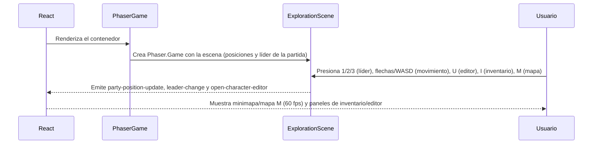

# Grafo del Proyecto

Este documento es el mapa de rutas y responsabilidades del proyecto. Consultalo antes de buscar la ubicacion de un archivo, componente, servicio o modulo. Cuando se agregue, mueva o elimine una pieza estructural, actualiza este grafo en el mismo cambio.

```mermaid
flowchart TD
    Root[Maniqui-Db]

    Root --> Frontend[frontend/\nReact + Vite]
    Root --> Backend[backend/\nNode.js + Express]
    Root --> SQL[sentencias-sql/\nMySQL y modelo de datos]
    Root --> Infra[docker-compose.yml\nstart-app.sh]
    Root --> Design[Documento de Diseño y Arquitectura - RPG Táctico Web.md\nrequisitos y hoja de ruta]
    Root --> Readme[README.md\ninstalacion y comandos]
    Root --> Context[docs/contexto-agente.md\ncontexto operativo y seguimiento]

    Frontend --> App[frontend/src/App.jsx\ncomposicion de la interfaz]
    Frontend --> Styles[frontend/src/App.css\nfrontend/src/index.css]
    Frontend --> Components[frontend/src/components/]
    Frontend --> Hooks[frontend/src/hooks/]
    Frontend --> Services[frontend/src/services/]
    Frontend --> Game[frontend/src/game/]
    Frontend --> Assets[frontend/src/assets/\nfrontend/public/]

    Components --> CharacterForm[CharacterForm.jsx]
    Components --> ExplorationView[ExplorationView.jsx\nvista separada de exploracion]
    Components --> PhaserGame[PhaserGame.jsx\npuente React -> Phaser]
    Components --> Inventory[components/inventory/\nInventoryPanel compone\nuseInventoryPanel.js\ninventoryUtils.js\ninventoryOperations.js\ninventoryKeyHandler.js\nInventoryHeader.jsx\nInventoryGrid.jsx\nInventoryDetail.jsx\nInventoryStats.jsx]
    Components --> Hotbar[Hotbar.jsx\nbarra de acceso rapido (overlay y panel)]
    Components --> ItemTooltip[ItemTooltip.jsx\nficha flotante de objeto]
    Components --> Minimap[Minimap.jsx\nminimapa con zoom, rueda y drag]
    Components --> MapModules[components/map/\nMapView.jsx\nuseMapCanvasController.js]
    Components --> FormParts[components/form-parts/\nAppearanceFields.jsx\nStatsFields.jsx]
    Components --> MainMenu[MainMenu.jsx\ncompositor del menu inicial]
    Components --> MenuModules[components/mainmenu/\nMenuHome.jsx · MenuCargar.jsx · MenuNueva.jsx\nOpcionesStack.jsx · MenuOpciones.jsx\nMenuOpcionesAudio.jsx · MenuOpcionesVideo.jsx\nMenuOpcionesTeclas.jsx\nuseMenuNav.js · useOpciones.js · useOpcionesVideo.js\nuseTeclas.js · utils.js]

    Hooks --> UsePersonajes[usePersonajes.js\nestado y operaciones de personajes]
    Hooks --> UseHotbar[useHotbar.js\nestado y persistencia de la hotbar]
    Hooks --> UseItemTooltip[useItemTooltip.js\nestado del tooltip de objeto]
    Services --> Api[services/api.js\ncliente HTTP]
    Game --> Exploration[game/ExplorationScene.js\nescena Phaser 3]
    Game --> Iso[game/isometric.js\nproyección iso 48×24]
    Game --> Collision[game/collision.js\ncolisiones por hitbox de objeto]
    Game --> Board[game/board.js\noverlay de cuadrícula y posiciones seguras]
    Game --> Party[game/party.js\nfichas del grupo y marcador de líder]
    Game --> Decor[game/decor.js\nárboles y arbustos 2.5D]
    Game --> Movement[game/movement.js\nmovimiento continuo del grupo]
    Game --> Input[game/input.js\natajos de la escena]
    Game --> Hotkeys[game/hotkeys.js\nlíder 1/2/3]
    Game --> Bindings[game/bindings.js\ntezas configurables]
    Game --> InputLock[game/inputLock.js\nbloqueo de input]
    Game --> VideoSettings[game/videoSettings.js\nvideo/overlay]
    Game --> PartyPositions[game/partyPositionsStore.js\nposiciones en vivo del grupo]
    Game --> HotbarConfig[game/hotbarConfig.js\nconfig de la hotbar]
    Game --> MapCanvas[game/mapCanvas.js\ndibujado del mapa M y minimapa]
    Game --> GameEvents[game/gameEvents.js\nCustomEvent compartidos]
    ExplorationView --> PhaserGame
    ExplorationView --> Inventory
    ExplorationView --> Minimap
    ExplorationView --> MapModules
    Minimap --> MapModules
    MapModules --> MapCanvas
    PhaserGame --> GameEvents
    PhaserGame --> Exploration
    Inventory --> InventoryState[inventory/useInventoryPanel.js\nestado y acciones]
    Inventory --> InventoryHelpers[inventory/inventoryUtils.js\nnormalizacion y navegacion]
    Inventory --> InventoryOps[inventory/inventoryOperations.js\noperaciones puras y carga]
    Inventory --> InventoryKeys[inventory/inventoryKeyHandler.js\ntratamiento de teclado]
    Inventory --> InventoryViews[inventory/InventoryGrid.jsx\nInventoryDetail.jsx\nInventoryStats.jsx]
    App --> Components
    App --> Hooks
    Hooks --> Api
    Api --> Backend

    Backend --> Entry[backend/index.js\nservidor Express]
    Backend --> Routes[backend/routes/personajesRoutes.js\nrutas HTTP]
    Backend --> Controllers[backend/controllers/personajesController.js\ncontrolador delgado]
    Backend --> Services[backend/services/\npersonajesService.js\ninventarioService.js]
    Backend --> Utils[backend/utils/\nasyncDb.js\nerrors.js]
    Backend --> Db[backend/config/db.js\npool MySQL]
    Entry --> Routes
    Routes --> Controllers
    Controllers --> Services
    Services --> Utils
    Utils --> Db
    Db --> SQL

    SQL --> Create[sentencias-sql/creaciones.sql]
    SQL --> Insert[sentencias-sql/inserciones.sql]
    SQL --> Queries[sentencias-sql/consultas.sql]
    SQL --> Views[sentencias-sql/vistas.sql]
    SQL --> Model[sentencias-sql/EER Diagram.mwb]
```

## Rutas clave

| Necesidad | Ruta principal | Depende de |
| --- | --- | --- |
| Entrada de la interfaz | `frontend/src/App.jsx` | componentes, hook de personajes y Phaser |
| Menu inicial | `frontend/src/components/MainMenu.jsx` | `mainmenu/MenuHome.jsx`, `MenuCargar.jsx`, `MenuNueva.jsx`, `MenuOpciones.jsx`, `MenuOpcionesVideo.jsx` |
| Vista separada de exploracion | `frontend/src/components/ExplorationView.jsx` | `PhaserGame.jsx` |
| Montar Phaser en React | `frontend/src/components/PhaserGame.jsx` | `frontend/src/game/ExplorationScene.js` |
| Mostrar inventario | `frontend/src/components/InventoryPanel.jsx` | `inventory/useInventoryPanel.js`, `gameEvents.js` |
| Minimapa con zoom | `frontend/src/components/Minimap.jsx` | `map/useMapCanvasController.js`, `game/mapCanvas.js`, `usePartyPositions.js` |
| Mapa completo (tecla M) | `frontend/src/components/map/MapView.jsx` | `map/useMapCanvasController.js`, `game/mapCanvas.js`, `usePartyPositions.js` |
| Dibujado de mapas (diamante iso) | `frontend/src/game/mapCanvas.js` | `game/isometric.js`, `game/collision.js`, `game/constants.js` |
| Proyeccion isometrica (48×24) | `frontend/src/game/isometric.js` | `game/constants.js` |
| Colision (hitbox por objeto) | `frontend/src/game/collision.js` | `game/isometric.js`, `ExplorationScene.js`, `decor.js` |
| Overlay de cuadricula y posiciones seguras | `frontend/src/game/board.js` | `game/collision.js`, `game/isometric.js` |
| Fichas del grupo y marcador | `frontend/src/game/party.js` | `game/constants.js`, `isometric.js` |
| Decoracion 2.5D (arboles/arbustos) | `frontend/src/game/decor.js` | `game/constants.js`, `isometric.js` |
| Movimiento continuo del grupo | `frontend/src/game/movement.js` | `game/board.js`, `game/bindings.js` |
| Logica del mapa y exploracion | `frontend/src/game/ExplorationScene.js` | Phaser 3 |
| Eventos compartidos React-Phaser | `frontend/src/game/gameEvents.js` | `CustomEvent`, `PhaserGame.jsx`, `ExplorationScene.js` |
| Estado y actualización de personajes | `frontend/src/hooks/usePersonajes.js` | `frontend/src/services/api.js` |
| Peticiones al backend | `frontend/src/services/api.js` | API Express |
| Entrada de la API | `backend/index.js` | rutas y conexion MySQL |
| Rutas de personajes | `backend/routes/personajesRoutes.js` | controlador de personajes |
| Logica de personajes | `backend/services/personajesService.js` | `backend/utils/asyncDb.js` |
| Logica de inventario | `backend/services/inventarioService.js` | `backend/utils/asyncDb.js` |
| Controlador delgado | `backend/controllers/personajesController.js` | servicios de personajes e inventario |
| Conexion a la base de datos | `backend/config/db.js` | MySQL/Docker |
| Esquema y datos SQL | `sentencias-sql/` | `docker-compose.yml` |
| Requisitos y hoja de ruta del RPG | `Documento de Diseño y Arquitectura - RPG Táctico Web.md` | grafo y arquitectura |
| Contexto de trabajo y seguimiento | `docs/contexto-agente.md` | diseño, README y grafo |
| Configuracion de dependencias frontend | `frontend/package.json` | pnpm |
| Arranque completo | `start-app.sh` | Docker, backend y frontend |
```

## Flujo de juego actual


